# 👋 Hi, I'm Arman
### I'm a college student trying to be consistent and become better every day.

  
  

---

## 🧰 Tech Stack

  

  
  
  
  
  
  
  
  
  

### 🧠 Core CS

  
  
  
  
  
  

---

## 🎧 Coding Mode

  
   
  🎵 Code • Learn • Repeat

---

## 📊 GitHub Stats

  
  

  Stats are generated by GitHub Actions and stored directly in this repository.

---

### 🚀 One day better than yesterday.

